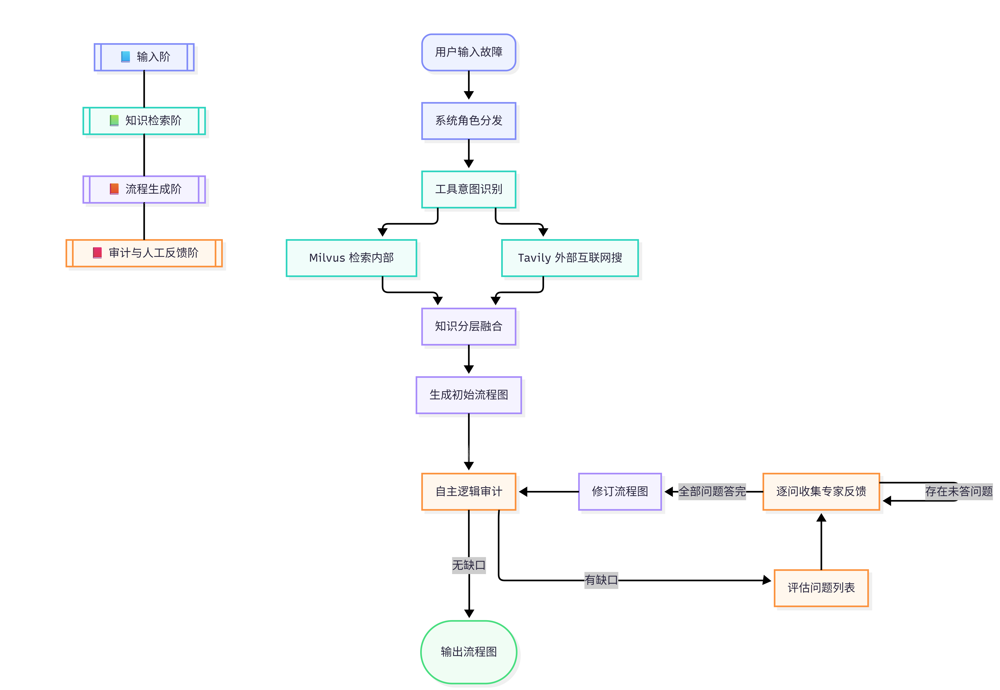

# 工业故障诊断 LangGraph Agent

这是一个面向工业现场故障排查的 AI Agent 项目。项目以 LangGraph 编排诊断流程，结合 Milvus/Zilliz 向量知识库、Tavily 外部检索和大模型推理，自动生成可审计、可修订的 Mermaid 故障排查流程图，并将诊断报告与历史案例保存到本地。

## 核心能力

- **SOP 知识库检索**：从 Milvus/Zilliz 或本地 milvus-lite 中检索工业故障 SOP 知识。
- **外部资料补充**：在内部知识不足时调用 Tavily 搜索最新维修资料。
- **LangGraph 多节点编排**：按“检索 -> 融合 -> 生成 -> 审计 -> 专家反馈 -> 修订”的流程执行。
- **人机协同审计**：当流程图存在缺口时，Agent 会提出问题并等待专家反馈；也支持自动反馈模式。
- **报告与记忆沉淀**：输出 Mermaid 流程图、Markdown 诊断报告和 JSON 历史诊断记忆。
- **Web/SSE 接口**：`web_server.py` 提供流式诊断 API，便于接入前端。

## 模型框架



## 诊断流程

```text
故障描述
  -> 内部 SOP 检索（Milvus）
  -> 外部资料检索（Tavily）
  -> 知识过滤与融合
  -> 生成 Mermaid 排查流程图
  -> 审计完整性与准确性
  -> 如有缺口，收集专家反馈并修订
  -> 保存流程图、报告和历史记忆
```

## 项目结构

```text
.
├── fault_agent.py             # 核心 LangGraph Agent：诊断、审计、反馈修订
├── init_knowledge_base.py     # 初始化工业故障 SOP 向量知识库
├── sop_documents.py           # 内置 SOP 文档数据
├── mcp_tools.py               # 保存报告、流程图、诊断记忆等工具函数
├── web_server.py              # FastAPI + SSE Web/API 服务
├── Milvus.py                  # Milvus 连接与集合管理封装
├── md_to_word.py              # Markdown 报告转 Word 的辅助脚本
├── run_*.py / fix_*.py        # Notebook/测试辅助脚本
└── output/
    ├── diagrams/              # 生成的 Mermaid 与 Markdown 报告
    └── memory/                # 诊断历史 JSON
```

## 环境变量

在项目根目录创建 `.env`，至少配置：

```env
ARK_API_KEY=你的大模型或兼容 OpenAI 接口的 API Key
ARK_BASE_URL=https://api.siliconflow.cn/v1
TAVILY_API_KEY=你的 Tavily API Key
trivily_key=你的 Tavily API Key
```

Milvus 连接二选一即可：

```env
# 方式一：自建 Milvus
MILVUS_HOST=127.0.0.1
MILVUS_PORT=19530
MILVUS_USER=root
MILVUS_PASSWORD=

# 方式二：Zilliz Cloud
URL=你的 Zilliz/Milvus URI
Token=你的 Token
```

如果不配置 Milvus 服务，代码会尝试使用 `output/milvus_local.db` 作为本地 milvus-lite 存储。

## 安装依赖

项目当前没有固定的 `requirements.txt`，可按源码依赖安装：

```bash
pip install langgraph langchain-openai langchain-core pymilvus milvus-lite fastapi uvicorn pydantic python-dotenv requests tavily-python langfuse duckduckgo-search pandas tqdm python-docx markdown funasr
```

建议使用 Python 3.10+。当前本地环境显示为 Python 3.7，部分新版本依赖可能不再兼容 3.7。

## 快速开始

### 1. 初始化知识库

```bash
python init_knowledge_base.py
```

该命令会读取 `sop_documents.py`，生成 embedding，并写入 `industrial_fault_knowledge` 集合。

### 2. 命令行诊断

```bash
python fault_agent.py
```

按提示输入故障描述，并选择：

- `y`：自动模式，Agent 自动补充审计反馈。
- `n`：人机协同模式，审计发现缺口时等待专家逐条反馈。

### 3. Web/API 服务

```bash
python web_server.py
```

默认监听：

```text
http://localhost:8000
```

主要接口：

- `POST /api/start`：开始诊断，返回 SSE 流。
- `POST /api/resume`：提交专家反馈并继续诊断。
- `GET /api/history`：查看历史诊断记录。
- `GET /api/diagram/{name}`：读取 Mermaid 流程图。
- `GET /api/report/{name}`：读取 Markdown 诊断报告。
- `GET /api/memory/{name}`：读取诊断记忆 JSON。

请求示例：

```json
{
  "fault_input": "PLC 与上位机通信中断，HMI 显示通信超时",
  "auto_mode": false
}
```

## 输出结果

诊断完成后会生成：

- `output/diagrams/*_diagram.mmd`：Mermaid 流程图。
- `output/diagrams/*_report.md`：完整诊断报告。
- `output/memory/*.json`：结构化历史诊断记忆。

## 注意事项

- `web_server.py` 默认挂载 `static/app.html`。
- `main.py` 引用了 `Local_Model`、`Knowledge_Grpah`、`ContextRouter` 等当前仓库未提供的模块，更像是实验性/扩展入口；推荐优先使用 `fault_agent.py` 和 `web_server.py`。
- 源码中部分中文注释或字符串存在编码乱码，不影响整体架构理解，但建议后续统一为 UTF-8。
- `.env`、`env.env` 等密钥文件已加入 `.gitignore`，不要提交真实 API Key。

## 适用场景

该项目适合用于工业设备故障诊断、维修 SOP 辅助生成、专家经验沉淀，以及将历史排障案例逐步转化为可检索知识库的原型系统。
